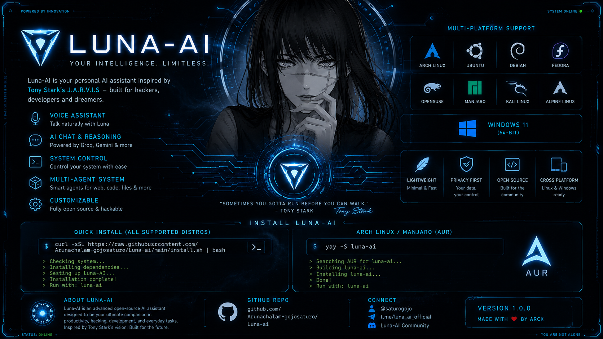
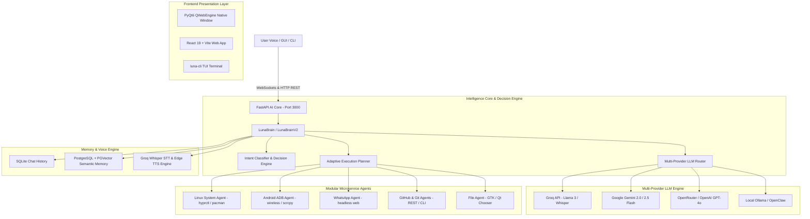

<div align="center">
  
  <br/><br/>
  
  <h1>🌙 Luna AI (Luna OS X)</h1>
  <p><strong>Next-Generation Autonomous Personal AI Operating System & Voice Companion for Arch Linux & Multi-Linux Distributions</strong></p>

  [](https://archlinux.org/)
  [](https://aur.archlinux.org/)
  [](https://fastapi.tiangolo.com/)
  [](https://reactjs.org/)
  [](https://www.qt.io/)
  [](LICENSE)
</div>

---

## 🌌 What is Luna AI?

**Luna AI** (also known as **Luna OS X**) is an autonomous personal AI operating system designed to deeply integrate with your Linux environment (optimized for **Arch Linux, Hyprland, Wayland, and GTK/Qt desktop environments**).

Unlike simple chat web pages, Luna acts as an **always-on digital companion and system manager**. She combines continuous voice recognition, real-time audio synthesis, native desktop application embedding, wireless Android (ADB) device management, WhatsApp automation, and multi-provider LLM intelligence routing into one unified ecosystem.

---

## ⚡ Quick Installation

### 🌐 Option A: Universal One-Line Installer (Any Linux Distro)
Supports **Arch Linux, Ubuntu, Debian, Pop!_OS, Linux Mint, Fedora, RHEL, openSUSE, and Alpine**.
Automatically detects your OS, installs system dependencies, creates Python virtual environments, builds web assets, and sets up launcher binaries:

```bash
curl -sSL https://raw.githubusercontent.com/Arunachalam-gojosaturo/Luna-ai/main/install.sh | bash
```

---

### 📦 Option B: Arch Linux AUR Package (`yay` / `paru`)
If you are running Arch Linux or any Arch-based distribution:

```bash
yay -S luna-ai
# or
paru -S luna-ai
```

---

### 🛠️ Option C: Manual Installation
```bash
git clone https://github.com/Arunachalam-gojosaturo/Luna-ai.git
cd Luna-ai
./install.sh
```

---

## ✨ Core Features & Capabilities

* 🎙️ **Always-On Voice Recognition**: Continuous background listening with automatic silence detection powered by Groq Whisper (`whisper-large-v3-turbo`) & Google Speech Recognition fallback.
* 🗣️ **Native Neural TTS Synthesis**: Real-time voice generation streaming through Microsoft Edge TTS or ElevenLabs, played via `mpv`/`ffplay`/`paplay`.
* 🖥️ **Deep Arch Linux & Hyprland Integration**:
  * **App Control**: Launch or terminate desktop applications (`xdg-open`, `kitty`, `rofi`, etc.).
  * **Hyprland Workspace Management**: Switch active workspaces via `hyprctl`.
  * **Volume & Media**: Native system audio adjustments (`wpctl`, `pactl`, `playerctl`).
  * **Folder Pickers**: 4-tier fallback directory chooser dialogs (`zenity`, `kdialog`, `PyQt6`, `tkinter`).
* 📱 **Wireless Android ADB Bridge**:
  * Auto-discovers and connects wirelessly to Android devices on your network.
  * Unlocks devices with stored PIN, controls touch events (`tap`, `swipe`, `text`), and launches wireless screen mirroring via `scrcpy`.
* 💬 **WhatsApp Web Automation**: Headless WhatsApp Web manager for sending and receiving messages via AI.
* 🛠️ **Developer Workspace & GitHub Dashboard**: View repositories, inspect git status, stage commits, push updates, and view system files directly inside Luna's UI.
* 🛡️ **Secure Command Whitelisting**: Pattern-based safety engine intercepting privileged commands and prompting visual `pkexec` dialogs. No silent background `sudo` risks.
* 💻 **Dual GUI & CLI Interfaces**:
  * **Native Desktop App**: 100% native PyQt6 QWebEngine application window with zero browser tabs or address bar.
  * **Enhanced TUI CLI**: Terminal UI (`luna-cli`) featuring ANSI color themes, ASCII banners, session telemetry, and live WebSocket event streams.

---

## 📐 Architecture Blueprint

Luna OS X follows a **Decoupled Client-Server & Multi-Agent Microservice Architecture**:



---

## 📂 Repository Directory Tree

```
Luna-ai/
├── assets/
│   ├── deskopticon.png             # Official Luna AI Desktop Icon
│   ├── readme-header.png           # Official GitHub README Header Banner
│   └── luna-logo.png               # Brand Logo
├── backend/                        # Python FastAPI AI Operating System Core
│   ├── agents/                     # Specialized Microservice Agents
│   │   ├── base_agent.py           # Base Agent Interface Class
│   │   ├── file_agent.py           # Local File System Operations Agent
│   │   ├── git_agent.py            # Local Git Repository Manager
│   │   ├── github_agent.py         # GitHub REST API Integration Agent
│   │   ├── linux_agent.py          # Arch Linux / System Command Execution Agent
│   │   ├── package_manager.py      # System Package Management (pacman/yay/apt/dnf)
│   │   ├── system.py               # Re-exported System Agent Module
│   │   └── whatsapp_agent.py       # Headless WhatsApp Web Automation Agent
│   ├── api/                        # REST & WebSocket API Routers
│   │   ├── agents.py               # Microservice Agent Endpoints
│   │   ├── routes.py               # Core Luna Execution, STT/TTS & System Media Routes
│   │   └── ws.py                   # WebSocket Real-Time Event Listener
│   ├── config/                     # Backend Configuration & Directory Paths
│   │   └── paths.py                # Cache, Log, and Asset Path Resolvers
│   ├── core/                       # Brain Intelligence & Decision Framework
│   │   ├── agent_orchestrator.py   # Multi-Agent Workflow Coordinator
│   │   ├── brain.py                # Main LunaBrain Intelligence Core
│   │   ├── brain_v2.py             # Next-Gen Jarvis-Class Intelligence Engine
│   │   ├── context_engine.py       # Live System Telemetry Ingestion (psutil)
│   │   ├── decision_engine.py      # Intent Classifier & Verification Engine
│   │   ├── executor.py             # Plan Step Execution Engine
│   │   ├── planner.py              # Adaptive Planning Engine (Fast/Normal/Deep)
│   │   ├── prompt.py               # System Prompt Builder with OS Context
│   │   ├── provider.py             # Multi-Provider Routing Strategy
│   │   ├── task_manager.py         # Background Async Task Tracker
│   │   └── voice_agent.py          # Native Microphone Listener & VAD Pipeline
│   ├── memory/                     # Multi-Tier Memory Persistence Engine
│   │   ├── chat_history.py         # SQLite Conversation Storage
│   │   ├── db.py                   # Async PostgreSQL / PGVector ORM Engine
│   │   ├── embeddings.py           # Semantic Search Vector Memory
│   │   ├── long_term_memory.py     # Persistent Knowledge Retrieval
│   │   ├── summarizer.py           # Context Compression & Summarization
│   │   └── working_memory.py       # Active Task Transient State
│   ├── providers/                  # LLM Provider Handlers
│   │   └── provider_manager.py     # Groq, OpenAI, Gemini, OpenRouter Routing
│   ├── tools/                      # Tool Registries
│   │   └── tool_registry.py        # System Tool Definitions & Whitelists
│   ├── utils/                      # Low-Level OS Utilities
│   │   ├── adb_manager.py          # Wireless Android ADB & scrcpy Controller
│   │   ├── audio_check.py          # ALSA / PulseAudio Check Utility
│   │   └── sys_control.py          # Media Key & Hyprland Window Controller
│   ├── voice/                      # Audio Signal Processing Pipelines
│   │   ├── stt.py                  # Groq Whisper & Speech Recognition STT
│   │   └── tts.py                  # Microsoft Edge TTS & ElevenLabs Pipeline
│   └── main.py                     # FastAPI ASGI Server Entry Point (Port 3000)
├── public/                         # Web Engine Static Assets
│   ├── background.png              # UI Background Image
│   └── deskopticon.png             # Desktop Application Icon
├── src/                            # React 19 Frontend Interface
│   ├── components/                 # React UI Modules
│   │   ├── DeveloperWorkspace.tsx  # Interactive Code & File Manager View
│   │   ├── DeviceEcosystem.tsx     # Android ADB & Hardware Control Panel
│   │   ├── GithubMonitor.tsx       # GitHub Profile & Repository Dashboard
│   │   ├── HealthHub.tsx           # System Diagnostics & Health Monitor
│   │   ├── MobileScreenModal.tsx   # Interactive Mobile Screen Mirroring Modal
│   │   ├── ReactorCore.tsx         # AI Core Telemetry & Reasoning Visualizer
│   │   └── SettingsPanel.tsx       # API Keys & Provider Settings Panel
│   ├── App.tsx                     # Main React Application & State Machine
│   ├── main.tsx                    # React DOM Entry Point
│   └── types.ts                    # TypeScript Interfaces & Enums
├── scripts/                        # Utility Scripts
│   └── read_web.py                 # Scraping & Web Extraction Utility
├── .env.example                    # Sample Environment Variables Configuration
├── CLI_GUIDE.md                    # Detailed CLI User Guide
├── install.sh                      # Universal Multi-Linux One-Line Installer
├── install_arch_app.sh             # Native Arch Linux Application Installer
├── luna_cli_enhanced.py            # Rich Terminal TUI CLI Interface
├── luna_desktop.py                 # 100% Native PyQt6 QWebEngine Desktop Launcher
├── Luna-AI.desktop                 # Linux Freedesktop Desktop Entry File
├── PKGBUILD                        # Arch Linux Official AUR Package Build Script
├── .SRCINFO                        # Arch Linux AUR Metadata Specification
├── package.json                    # Node.js Project Dependencies & Scripts
├── pyproject.toml / requirements.txt# Python Package Dependencies
└── README.md                       # Comprehensive Project Documentation
```

---

## ⚙️ Environment Configuration (`.env`)

Create a `.env` file in the root directory to specify your API credentials:

```env
# AI Providers
GROQ_API_KEY=your_groq_api_key
OPENAI_API_KEY=your_openai_api_key
GEMINI_API_KEY=your_gemini_api_key
OPENROUTER_API_KEY=your_openrouter_api_key

# Integrations
GITHUB_TOKEN=your_github_personal_access_token
ELEVENLABS_API_KEY=your_elevenlabs_key
```

---

## 💻 How to Launch Luna AI

Once installed via `install.sh` or `yay -S luna-ai`:

```bash
# 1. Start Native PyQt6 GUI Window
luna-ai
# or short alias:
luna

# 2. Start Rich Terminal CLI
luna-cli
```

---

## 🤝 Contributing

Contributions are welcome! Please feel free to open issues or submit pull requests on [GitHub](https://github.com/Arunachalam-gojosaturo/Luna-ai).

---

## 📜 License

Distributed under the **MIT License**. See `LICENSE` for more information.
